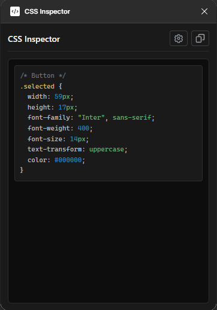

# CSS Inspector - Figma Plugin



A Figma plugin that displays selected element styles as clean CSS code and automatically copies selected text to clipboard.

## Features

- 📋 Display selected element styles in CSS format
- ✨ Auto-copy on text selection (mouseup)
- 🎯 Support for all major CSS properties
- 🔄 Reactive updates on selection change
- 💡 Compact UI with resizable window
- 🎨 Support for text styles, colors, shadows, border-radius, flexbox
- 📏 Distance measurement between two elements
- 🎨 Syntax highlighting for CSS code
- 💾 Save window size preferences

## Installation

### 1. Prepare Files

Make sure you have all files:
- `manifest.json`
- `code.js`
- `ui.html`

### 2. Load in Figma

1. Open Figma Desktop app
2. Go to menu: **Plugins → Development → Import plugin from manifest...**
3. Select `manifest.json` file from project folder
4. Plugin will appear in Development plugins list

### 3. Run Plugin

1. In Figma: **Plugins → Development → CSS Inspector**
2. Select any element on canvas
3. CSS styles will appear in plugin window

## Usage

### Main Features

1. **Select Element**: Click on any layer in Figma
2. **View CSS**: Styles will display in plugin window
3. **Auto-copy**: Select any text in window → it automatically copies
4. **Copy All**: Click copy icon button to copy entire CSS
5. **Measure Distance**: Select exactly 2 elements to see distance between them
6. **Resize Window**: Use settings button to adjust window size

### Supported Properties

- `width`, `height` - element dimensions
- `font-family`, `font-size`, `font-weight` - text styles
- `line-height`, `letter-spacing` - line spacing and kerning
- `text-transform` - text case transformation
- `color` - text color
- `background-color` - element background
- `border`, `border-radius` - borders and corners
- `opacity` - transparency
- `box-shadow` - shadows (drop shadow, inner shadow)
- `padding` - internal spacing (for auto-layout)
- `display: flex`, `flex-direction`, `justify-content`, `align-items`, `gap` - flexbox properties

### Distance Measurement

When you select exactly 2 elements, the plugin shows:
- **Horizontal distance** - between right edge of first and left edge of second element
- **Vertical distance** - between bottom edge of first and top edge of second element
- **Center distance** - direct distance between center points

### Output Example

```css
/* Button */
.selected {
  width: 120px;
  height: 40px;
  font-family: "Inter", sans-serif;
  font-weight: 600;
  font-size: 14px;
  color: #FFFFFF;
  background-color: #3B82F6;
  border-radius: 8px;
  box-shadow: 0 2px 4px rgba(0, 0, 0, 0.1);
}
```

## Settings

Click the settings icon to:
- Adjust window width (200-800px)
- Adjust window height (200-800px)
- Save preferred size
- Reset to default (360x480)

## Testing Scenarios

1. **Text Layer**
   - Create text layer with different styles
   - Select it → check font-family, font-size, color

2. **Frame with Auto-layout**
   - Create frame with auto-layout
   - Check display: flex, gap, padding

3. **Element with Shadow**
   - Add drop shadow to element
   - Check box-shadow in CSS

4. **Auto-copy**
   - Select part of CSS text with mouse
   - Release button → "Copied!" notification should appear
   - Paste (Ctrl+V) → text should be in clipboard

5. **Multiple Selection**
   - Select 2 elements
   - Should display distance measurements
   - Select 3+ elements → shows styles of first element

6. **Copy All Button**
   - Click copy icon
   - All CSS should be copied

## Technical Details

### Security

- Plugin doesn't require network access (`networkAccess: none`)
- Uses only Figma Plugin API
- `navigator.clipboard.writeText` works only in user event context (mouseup)

### Compatibility

- Figma Plugin API 1.0.0
- Modern browsers with Clipboard API support
- Pure JavaScript (ES6+)

## Project Structure

```
├── manifest.json      # Plugin configuration
├── code.js           # Main plugin logic
├── ui.html           # UI interface with embedded CSS and JS
└── package.json      # Project metadata
```

## License

MIT
